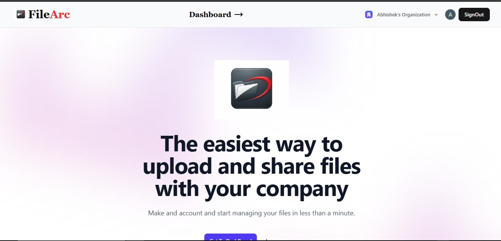
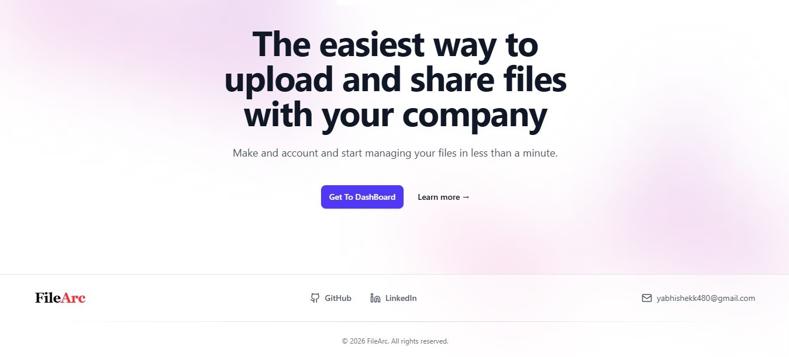
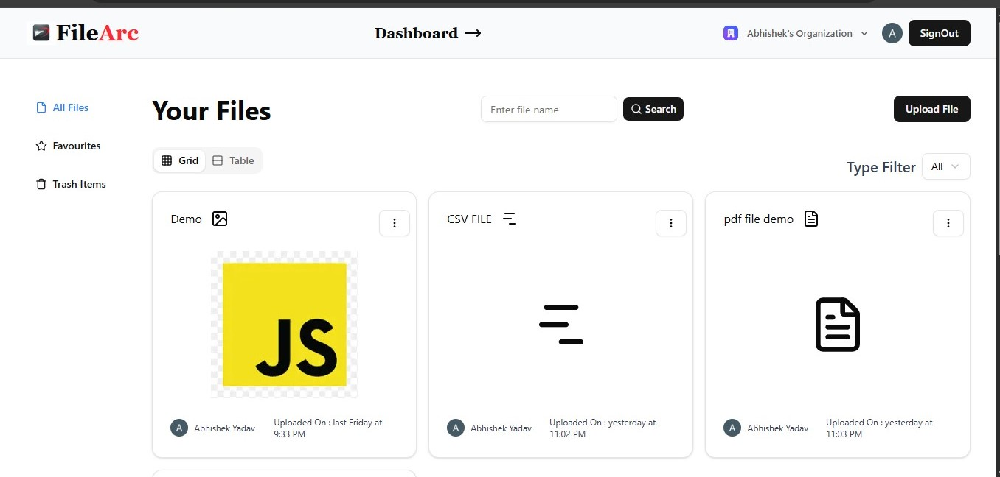
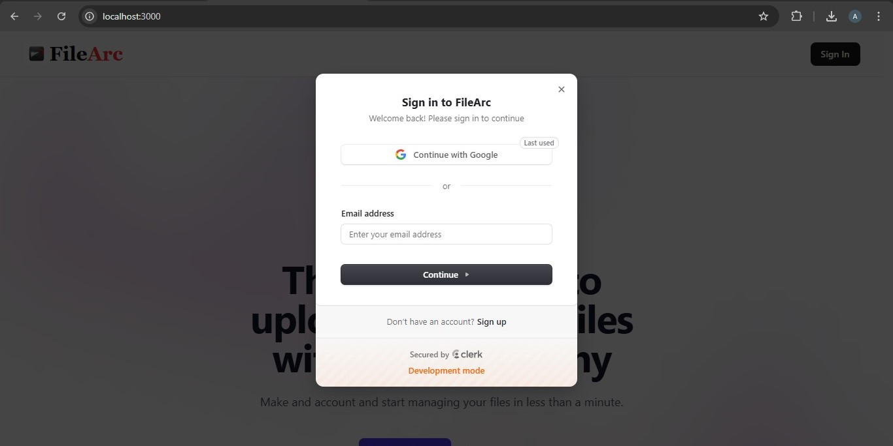
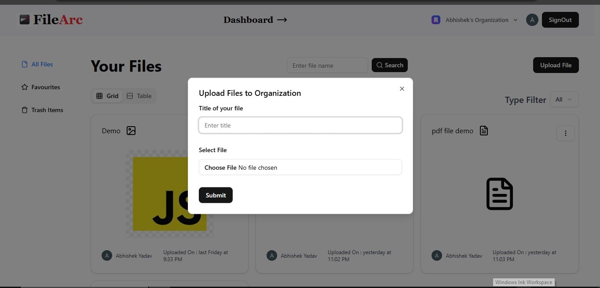
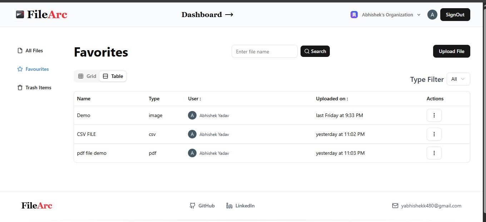
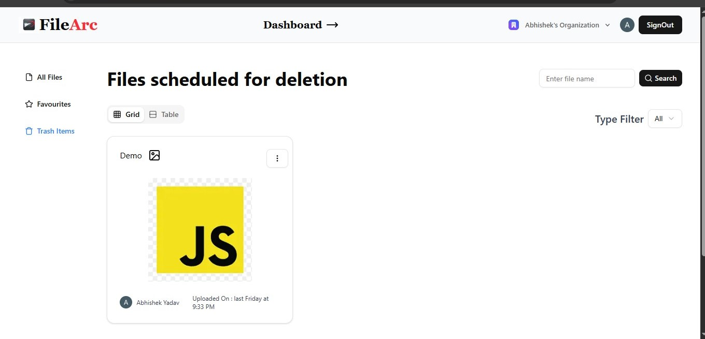

 📁 FileArc – File Storage & Management System

FileArc is a modern file storage and management platform** built with Next.js, Clerk Authentication, and Convex.  
It allows users to securely upload, store, organize, and manage files with a simple and intuitive interface.

---

  Features

- 🔐 Authentication with Clerk
  - Secure signup and login
  - Session management
  - Protected routes

- 📂 File Management
  - Upload files
  - View stored files
  - Download files
  - Delete files

- ⭐ Favorites System
  - Mark files as favorite
  - Easily access important files

- 🗂 File Organization
  - Categorize files by type
  - Search and browse files

- ⚡ Real-time Backend
  - Powered by Convex
  - Fast queries and mutations

- 🎨 Modern UI
  - Built with Next.js App Router
  - Responsive design

---

 🛠 Tech Stack

| Technology | Purpose |
|-----------|--------|
| Next.js | Frontend Framework |
| Clerk | Authentication |
| Convex | Backend & Database |
| TypeScript | Type Safety |
| Tailwind CSS | Styling |
| Lucide Icons | Icons |
 
### Homepage

 
### Dashboard
   

### Login
  

### Upload File
  

### Favourite File
  

### Trash Files
   

